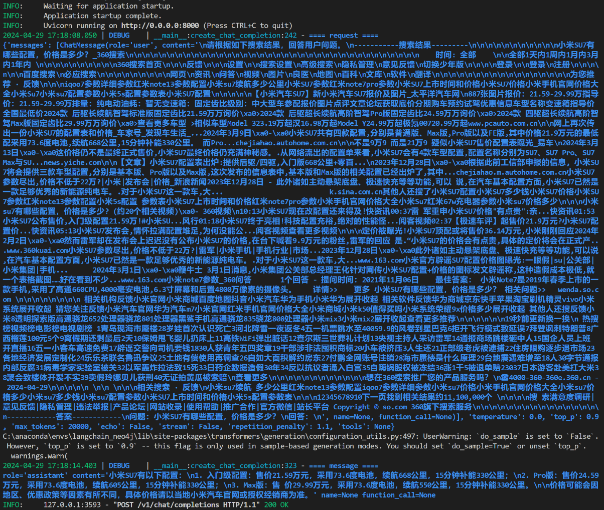

## 基于LangChain和ChatGLM3-6B的搜索引擎总结问答

> 一个小玩具demo：调用本地ChatGLM3-6B模型，使用LangChain实现的搜索引擎agent

## 环境准备


1. 为防止本项目文件过大，项目中没有放模型文件，需要自己下载：

```bash
# 在根目录下创建model文件夹, 然后分别git clone ChatGLM模型和Embedding模型
git clone https://www.modelscope.cn/ZhipuAI/chatglm3-6b.git
git clone https://www.modelscope.cn/AI-ModelScope/bge-large-zh-v1.5.git
```

目录结构是这样的：`./model/chatglm3-6b`和`./model/bge-large-zh-v1.5`


2. 创建、激活conda虚拟环境

```bash
$> conda create -n summary python=3.10
$> conda activate summary
```

3. 安装依赖

```bash
(summary) $> pip install -i https://pypi.tuna.tsinghua.edu.cn/simple -r requirements.txt
```

如果torch安装有问题可以直接去[官网下载](https://download.pytorch.org/whl/torch_stable.html)

```bash
(summary) $> pip install cu118/torch-2.1.2+cu118-cp310-cp310-win_amd64.whl
```

## 启动

1. 启动chatglm模型

```bash
(summary) $> python api_server.py
```

2. 然后新开一个终端测试

```bash
(summary) $> python app.py
```

效果如下图所示

